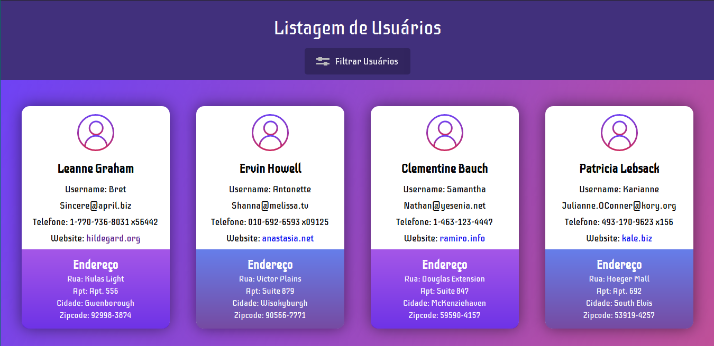

# Prova Frontend
## Este projeto consome uma API e tranforma os dados dos usúario retornados pela API em cards, ele também dispõe de uma ferramenta que filtra os usuários por domínio de email.

### API consumida : `https://jsonplaceholder.typicode.com/users`

### PrintScreen do projeto :

### Tecnologias usadas no projeto:
- HTML5
- CSS3
- JavaScript(Vanilla)
- Node.js e Express (Necessário para rodar um servidor local)

### Como usar :

- Acesse : https://dheimison.github.io/Prova-Frontend/public

OU

 - Clone o projeto em sua máquina usando o seguinte comando no terminal :
  
 <pre><code>
 git clone https://github.com/Dheimison/Prova-Frontend.git
 </code></pre>
  
 - Depois instale a dependência (EXPRESS) usada para montar um servidor local com o seguinte comando no seu terminal :
  
 <pre><code>
 yarn 
 </code></pre>
 OU 
 <pre><code>
 npm i
 </code></pre>
  
 - Para iniciar o servidor e visualizar o projeto no browser utilize no seu terminal o comando:
  

 <pre><code>
 yarn start
 </code></pre>

  OU 
<pre><code>
npm run start
</code></pre>
  

 #### O arquivo server.js contém as configuração do servidor local.
 O servidor iniciará em `localhost:8080` 
  
 Para usá-lo é só acessar esse endereço direto do seu navegador.